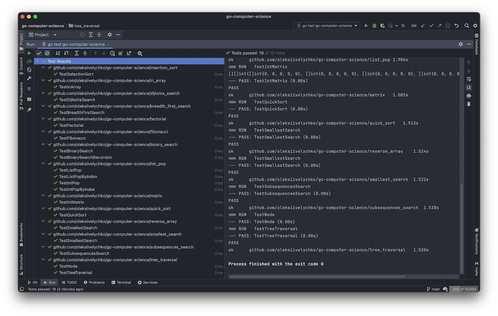

# go-computer-science

### The collection of the algorithms, data structures and design patterns to speed up the development process for most-daily cases.

📌 <a href="binary_search/binary_search.go">Binary search</a>

📌 <a href="breadth_first_search/breadth_first_search.go">Breadth-first search</a>

📌 <a href="dijkstra_search/dijkstra_search.go">Dijkstra's search</a>

📌 <a href="factorial/factorial.go">Factorial</a>

📌 <a href="fibonacci/fibonacci.go">Fibonacci</a>

📌 <a href="in_array/in_array.go">Checks if a value exists in an array</a>

📌 <a href="insertion_sort/insertion_sort.go">Insertion sort</a>

📌 <a href="interfaces/interfaces.go">Interfaces</a>

📌 <a href="matrix/matrix.go">Make a matrix</a>

📌 <a href="list_pop/list_pop.go">Pop item from list</a>

📌 <a href="quick_sort/quick_sort.go">Quick sort</a>

📌 <a href="reverse_array/reverse_array.go">Reverse array</a>

📌 <a href="smallest_search/smallest_search.go">Smallest search</a>

📌 <a href="subsequences_search/subset_sum.go">Subset sum</a>

📌 <a href="subsequences_search/subsequences_search.go">Subsequences search</a>

📌 <a href="tree_traversal/tree_traversal.go">Tree traversal</a>

💡 Run tests as:
```
go test -bench=. ./dirname
```

